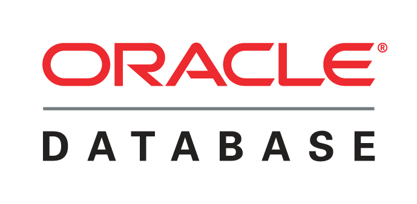
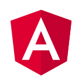

% Aplikacja: \
  Utrzymanie ruchu
% Krystian Chachuła
  Krystian Guliński
% 4. stycznia 2019
---
geometry: margin=3cm
lang: pl
toc-depth: 2
---

# Wykorzystana technologia

W celu stworzenia aplikacji działającej w oparciu o zaprojejektowaną przez nas bazę danych, zdecydowaliśmy że użyjemy frameworków, w używaniu których czujemy się najbardziej komfortowo. Wybór padł na następującą konfigurację.

## System zarządzania bazą danych

### Oracle Database

{ height=2cm }

Jako DBMS użyliśmy **Oracle Database**. Korzystaliśmy z serwera *Galera* znajdującego się na Wydziale Elektroniki i Technik Informacyjnych Politechniki Warszawskiej i dostępnego dla studentów. Decyzja to była spowodowana brakiem konieczności konfiguracji i uruchamiania lokalnego serwera oraz możliwością pracy na wspólnej bazie danych podczas tworzenia aplikacji.

## Back end (warstwa danych)

Warstwę danych zaprojektowaliśmy w taki sposób, aby aplikacja mogła w prosty sposób pobierać potrzebne jej dane z bazy.

Utworzyliśmy endpointy `/assignments`, `/failures`, `/machines`, `/tickets`, `/users` oraz `/comments`, które odpowiadają wybranym tabelom z bazy danych. Można odwoływać się do nich za pomocą różnych *metod HTTP*. Przyjęliśmy następującą konwencję:

* `GET` -- pobieranie
* `PUT` -- wstawianie
* `PATCH` -- aktualizowanie

### Node.js

{ height=2cm }

Jest to środowisko uruchomieniowe języka *JavaScript*, które pozwala na uruchamianie programów napisanych w tym języku na serwerze. Jest to obecnie bardzo popularna technologia o przeważających udziałach na rynku webdev.

### Express

{ height=2cm }

Express to minimalistyczny framework webowy dla *Node.js*. W prosty sposób pozwala udostępniać usługi poprzez protokół *HTTP*. Ma zaskakująco prosty interfejs. Warto przytoczyć przykład prostego serwera napisanego za pomocą tej biblioteki.

```JavaScript
const express = require('express');
const app = express();
const port = 3000;

app.get('/', (req, res) => res.send('Hello World!'));

app.listen(port, () => console.log(`Example app listening on port ${port}!`));
```

### node-oracledb

Dodatek do **Node.js** wspierający bazy **Oracle Database**. Jest to klient, który służył nam do komunikacji aplikacji z bazą danych. Jego konfiguracja była prosta. Mając zainstalowanego klienta **Oracle Database** wystarczyło stworzyć plik konfiguracyjny z adresem serwera oraz danymi dostępowymi. 

## Front end (warstwa prezentacji)

### Angular

{ height=2cm }

Platforma ułatwiająca tworzenie aplikacji webowych. Jest to bardzo rozbudowana programowa struktura ramowa, która pozwala szybko budować nowoczesne aplikacje.

### ReactiveX

{ height=2cm }
  
Biblioteka wspomagająca programowanie asynchroniczne. Jest polecana przez twórców *Angular* oraz silnie związana z całym systemem. W naszej aplikacji wykorzystujemy tylko część jej potencjału. Korzystamy z niej głównie do obsługi zapytań do warstwy danych. Jest to standardowy sposób rozwiązania problemu, który polega na tym, że serwer potrzebuje czasu na udzielenie odpowiedzi, nie dzieje się to natychmiast, a w tym czasie aplikacja powinna ciągle pozwalać użytkownikowi wchodzenie z nią w interakcję. 
  
# Zrzuty ekranu
